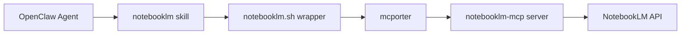

# OpenClaw NotebookLM Integration

[](https://badge.fury.io/py/openclaw-notebooklm)
[](https://pypi.org/project/openclaw-notebooklm/)
[](https://opensource.org/licenses/MIT)

**One-command installer** for integrating Google NotebookLM with OpenClaw via MCP.

## What This Does

This package automatically sets up a NotebookLM skill in OpenClaw, allowing your AI agents to:

- 📚 List all your NotebookLM notebooks
- 📝 Create new notebooks with sources
- 🔍 Query notebooks with natural language
- 📊 Generate study guides
- 🔗 Add sources (URLs, text, files) to notebooks

## Quick Start

### Installation

```bash
pip install openclaw-notebooklm
```

### Setup

Run the installer:

```bash
openclaw-notebooklm-install
```

The installer will:

1. ✅ Check prerequisites (OpenClaw, Node.js)
2. 📦 Install dependencies (mcporter, notebooklm-mcp)
3. 🔐 Authenticate with NotebookLM (opens Chrome)
4. 📂 Create the skill in `~/.openclaw/skills/notebooklm/`
5. ⚙️ Configure OpenClaw to use the skill
6. 🔄 Restart the OpenClaw daemon

That's it! 🎉

## Usage

### From OpenClaw Agents

Start a new OpenClaw session and ask:

```
List my NotebookLM notebooks
```

```
Create a NotebookLM notebook called "AI Research" with this URL: https://example.com
```

```
Ask my "Project Notes" notebook: What are the key takeaways?
```

```
Generate a study guide for my "Machine Learning" notebook
```

### From Command Line

```bash
# List notebooks
~/.openclaw/skills/notebooklm/notebooklm.sh list

# Create a notebook
~/.openclaw/skills/notebooklm/notebooklm.sh create "My Notebook" source_url=https://example.com

# Query a notebook
~/.openclaw/skills/notebooklm/notebooklm.sh ask <notebook-id> "Summarize this"

# Generate study guide
~/.openclaw/skills/notebooklm/notebooklm.sh study_guide <notebook-id>
```

## Requirements

- **OpenClaw**: Must be installed and configured
- **Node.js**: Required for npm packages (mcporter, notebooklm-mcp)
- **Google Account**: For NotebookLM authentication

## How It Works



1. **OpenClaw** loads the `notebooklm` skill
2. The skill uses a **wrapper script** to route commands
3. **mcporter** manages the MCP server lifecycle
4. **notebooklm-mcp** communicates with NotebookLM
5. Responses flow back to the agent

## Troubleshooting

### Skill not visible to agent

**Problem**: Agent says "I don't have the notebooklm skill"

**Solution**:
- Exit your current OpenClaw session
- Start a **new session** (skills are snapshot at session start)

### Authentication expired

**Problem**: "Error: Not authenticated to NotebookLM"

**Solution**:
```bash
notebooklm-mcp-auth
```

### mcporter not found

**Problem**: "mcporter: command not found"

**Solution**:
```bash
npm install -g mcporter
```

### Permission denied

**Problem**: Can't access mcporter config

**Solution**: The installer places config at `~/.openclaw/mcporter.json` which is accessible. If you move it, update the path in `~/.openclaw/openclaw.json`:

```json
{
  "skills": {
    "entries": {
      "notebooklm": {
        "env": {
          "MCPORTER_CONFIG": "/path/to/your/mcporter.json"
        }
      }
    }
  }
}
```

## File Locations

After installation:

```
~/.openclaw/
├── skills/
│   └── notebooklm/
│       ├── SKILL.md              # Skill metadata
│       └── notebooklm.sh         # Wrapper script
├── mcporter.json                  # mcporter config
└── openclaw.json                  # Updated with skill entry

~/.notebooklm-mcp/
└── auth.json                      # NotebookLM auth tokens
```

## Development

### Local Installation

```bash
git clone https://github.com/yourusername/openclaw-notebooklm.git
cd openclaw-notebooklm
pip install -e .
```

### Run Installer

```bash
openclaw-notebooklm-install
```

### Uninstall

```bash
# Remove the skill
rm -rf ~/.openclaw/skills/notebooklm

# Remove config entries (manual edit)
# Edit ~/.openclaw/openclaw.json and remove the "notebooklm" entry

# Restart daemon
openclaw daemon restart
```

## Contributing

Contributions welcome! Please:

1. Fork the repository
2. Create a feature branch
3. Make your changes
4. Submit a pull request

## License

MIT License - see [LICENSE](LICENSE) file for details.

## Credits

- **OpenClaw**: https://docs.openclaw.dev
- **mcporter**: https://github.com/wong2/mcporter
- **notebooklm-mcp**: https://github.com/wong2/notebooklm-mcp
- **Model Context Protocol**: https://spec.modelcontextprotocol.io

## Support

- 🐛 [Report Issues](https://github.com/yourusername/openclaw-notebooklm/issues)
- 💬 [Discussions](https://github.com/yourusername/openclaw-notebooklm/discussions)
- 📖 [Documentation](https://github.com/yourusername/openclaw-notebooklm#readme)

---

**Made with ❤️ for the OpenClaw community**
